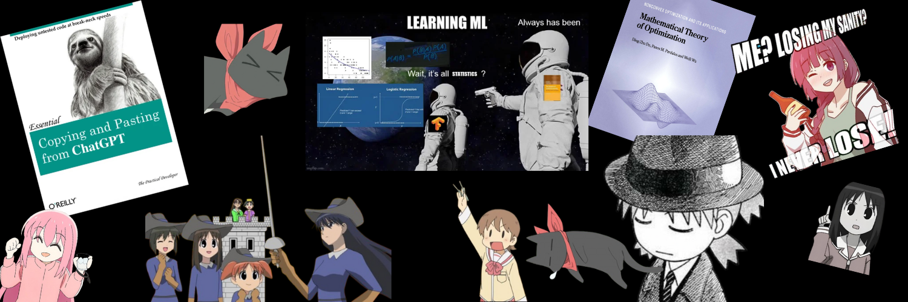

# Advent of ML

After procrastinating on my **Advent of ML Challenge** for quite some time, I finally decided that instead of just thinking about it, I should take the first step and start doing. I realized that action is the best way to learn and improve, and who knows where it will take me?

## What I'm Doing

I've started going through the resources on the **[d2l](https://d2l.ai/)** (Dive Into Deep Learning) website, which provides hands-on tutorials and explanations of fundamental ML concepts. To reinforce my learning, I am **coding along** with the examples and implementing classic machine learning algorithms and models from scratch.

Additionally, I’ll be tackling **LeetCode-style problem sets** focused on machine learning from **[Deep-ML](https://www.deep-ml.com/)** to further hone my problem-solving skills and solidify my understanding of key concepts.

I have also been learning **Deep Learning** from the **[Stats453 course by Sebastian Raschka on YouTube](https://www.youtube.com/playlist?list=PLTKMiZHVd_2KJtIXOW0zFhFfBaJJilH51)**. This course provides deep insights into the fundamentals of deep learning and is helping me grasp the theoretical concepts as well as the practical applications.

## My Goals

- **Upskilling**: As I progress, I'll be focusing on polishing my machine learning skills. 
- **Practical Experience**: I aim to apply the theories I learn and develop a deeper understanding of how different models work.
- **Growth**: I will also share my learnings and challenges, documenting my journey and progress as I move forward.

## What You’ll Find Here

I’ll be posting about:

- My **learning progress**
- **Challenges faced** and how I overcame them
- **Code snippets** and implementations
- Anything related to **upskilling** and improving my ML knowledge!

Feel free to follow along with me, and maybe we can learn together!

## Connect With Me

- **Twitter**: [Twitter](https://twitter.com/sodakeyEatsMush)  
- **Kaggle**: [Kaggle](https://www.kaggle.com/saad1926q)
